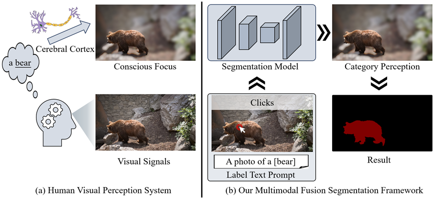

# Interactive Image Segmentation Based on Semantic Collaboration of Cross-modal Prior Information

<p align="center">
  
</p>


## Environment
Run the following command to install required packages.
```
pip3 install -r requirements.txt
```
## Demo
An example script to run the demo. 
```
python3 demo.py
```
Some test images can be found [here](https://github.com/uncbiag/SimpleClick/tree/v1.0/assets/test_imgs).

## Evaluation
Before evaluation, please download the datasets and models, and then configure the path in [config.yml](https://github.com/uncbiag/SimpleClick/blob/v1.0/config.yml).

Use the following code to evaluate the model.
```
python evaluate.py --gpu=0 --checkpoint=./weights/vit_huge.pth --eval-mode=cvpr --datasets=GrabCut,Berkeley,DAVIS,PascalVOC,SBD,COCO_MVal,ssTEM,BraTS,OAIZIB
```

## Training
Before training, please download the [MAE](https://github.com/facebookresearch/mae) pretrained weights (click to download: [ViT-Base](https://dl.fbaipublicfiles.com/mae/pretrain/mae_pretrain_vit_base.pth), [ViT-Large](https://dl.fbaipublicfiles.com/mae/pretrain/mae_pretrain_vit_large.pth)) and configure the dowloaded path in [config.yml](https://github.com/uncbiag/SimpleClick/blob/main/config.yml).

Use the following code to train the model.
```
python3 train.py
```

## Model weights 
models: [Google Drive](https://drive.google.com/drive/folders/1zVhZefCjsTBxvyxnYMVnbkrNeRCH6y9Y?usp=sharing)

## Datasets

We train all our models on SBD and COCO+LVIS and evaluate them on GrabCut, Berkeley, DAVIS, SBD and PascalVOC. We also provide links to additional datasets: ADE20k and OpenImages, that are used in ablation study.

| Dataset   |                      Description             |           Download Link              |
|-----------|----------------------------------------------|:------------------------------------:|
|MS COCO    |  118k images with 1.2M instances (train)     |  [official site][MSCOCO]             |
|LVIS v1.0  |  100k images with 1.2M instances (total)     |  [official site][LVIS]               |
|COCO+LVIS* |  99k images with 1.5M instances (train)      |  [original LVIS images][LVIS] + <br> [our combined annotations][COCOLVIS_annotation] |
|SBD        |  8498 images with 20172 instances for (train)<br>2857 images with 6671 instances for (test) |[official site][SBD]|
|Grab Cut   |  50 images with one object each (test)       |  [GrabCut.zip (11 MB)][GrabCut]      |
|Berkeley   |  96 images with 100 instances (test)         |  [Berkeley.zip (7 MB)][Berkeley]     |
|DAVIS      |  345 images with one object each (test)      |  [DAVIS.zip (43 MB)][DAVIS]          |
|Pascal VOC |  1449 images with 3417 instances (validation)|  [official site][PascalVOC]          |
|COCO_MVal  |  800 images with 800 instances (test)        |  [COCO_MVal.zip (127 MB)][COCO_MVal] |
|BraTS      |  369 cases (test)                            |  [BraTS20.zip (4.2 MB)][BraTS]       |
|OAI-ZIB    |  150 cases (test)                            |  [OAI-ZIB.zip (27 MB)][OAI-ZIB]      |

[ADE20k]: http://sceneparsing.csail.mit.edu/
[OpenImages]: https://storage.googleapis.com/openimages/web/download.html
[MSCOCO]: https://cocodataset.org/#download
[LVIS]: https://www.lvisdataset.org/dataset
[SBD]: http://home.bharathh.info/pubs/codes/SBD/download.html
[GrabCut]: https://drive.google.com/uc?export=download&id=1qKorUonIQcn3Z_IB6-en1K5q1K4T6pVK
[Berkeley]: https://drive.google.com/uc?export=download&id=1yo6PMKaMAu5jCCWf-Qf2boeG18b-m4vZ
[DAVIS]: https://drive.google.com/uc?export=download&id=1kyjN6EJSjwGnzSJxVjm3Pl2-XAjV7tac
[PascalVOC]: http://host.robots.ox.ac.uk/pascal/VOC/
[COCOLVIS_annotation]: https://drive.google.com/uc?export=download&id=17z9aZPlRv8vpU1AEz_M0WuZC6uBkqEWE
[COCO_MVal]: https://drive.google.com/uc?export=download&id=1_TgkjAmmpJLMIYSBRp89gaPNrFp_XxW5
[BraTS]: https://drive.google.com/uc?export=download&id=1uaveX_nziTLaJOj-Gl3csvIaa6Q__EhP
[OAI-ZIB]: https://drive.google.com/uc?export=download&id=11N6pJL5HowogUriCXVFbK3GacPL2X2Xx

Don't forget to change the paths to the datasets in [config.yml](config.yml) after downloading and unpacking.

(*) To prepare COCO+LVIS, you need to download original LVIS v1.0, then download and unpack our 
pre-processed annotations that are obtained by combining COCO and LVIS dataset into the folder with LVIS v1.0.

## License
This project is a modified version of [SimpleClick](https://github.com/uncbiag/SimpleClick) (MIT License).

## License
The code is released under the MIT License. It is a short, permissive software license. Basically, you can do whatever you want as long as you include the original copyright and license notice in any copy of the software/source. 

## Acknowledgement
Our project is developed based on [RITM](https://github.com/saic-vul/ritm_interactive_segmentation). Thanks for the nice demo GUI :)
